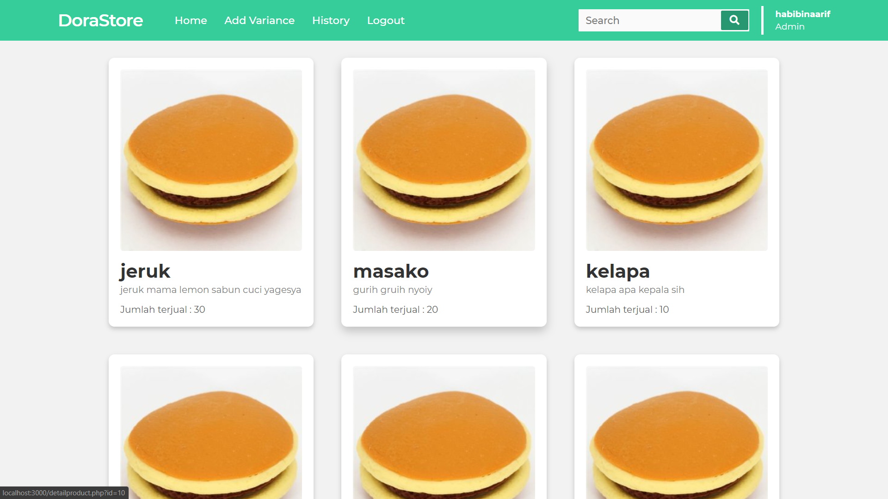

# IF3110-2021-K01-01-40
## Tugas Besar 1 WBD

## Deskripsi aplikasi web
Doremonangis,robot dari masa depan sedang mencoba untuk membuka suatu bisnis waralaba pada bidang F&B, yaitu membuat dorayaki kekinian (rasa pempek, rasa KFC, rasa nasipadang,dan lain-lain) ditahun 2021 ini. Oleh karena itu Doraemonangis menyuruh kelompok 40 untuk membuatkan sistem penjualan bisnis tersebut. Sistem tersebut harus memiliki sistem authentikasi, Pengelolaan Varian Dorayaki, Manajemen Stok Dorayaki, Melihat Daftar Varian Dorayaki, Riwayat Perubahan Stok Dorayaki, Pembelian Dorayaki, Riwayat Pembelian Dorayaki.

## Daftar requirement
1. HTML 5
2. PHP
3. SQLite

## Cara instalasi
1. Clone repository
2. Jalankan web server apache
3. Buka 'localhost' pada web browser

## Cara menjalankan server
1. Pindahkan file repo ke htdocs
2. Buka XAMPP
3. Nyalakan server Apache

## Screenshot 

DoraStore

## Pembagian Tugas
Server-side
- Login: 13519077
- Register: 13519077
- Dashboard: 13519077, 13519125
- Penambahan Varian Dorayaki Baru : 13519125
- Detail Varian Dorayaki : 13519077
- Pengubahan Stok/Pembelian Dorayaki : 13519077, 13519083, 13519125
- Riwayat PengubahanStok/PembelianDorayaki : 13519077, 13519083, 13519125

Client-side
- Login: 13519077
- Register: 13519077
- Dashboard : 13519077, 13519125
- HasilPencarian : 13519077, 13519083
- Penambahan Varian Dorayaki Baru : 13519125
- Pengubahan Stok/Pembelian Dorayaki : 13519077, 13519083, 13519125
- Detail Varian Dorayaki : 13519077
- Responsive Design : 13519077, 13519083, 13519125
- Riwayat PengubahanStok/PembelianDorayaki : 13519077
